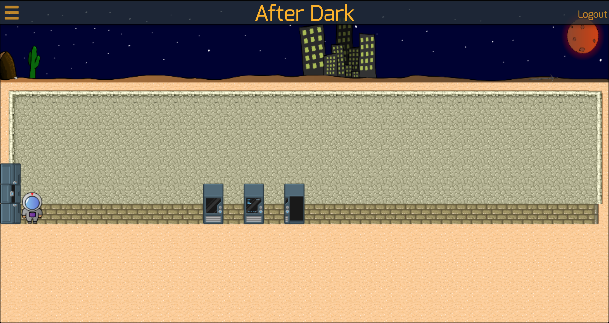
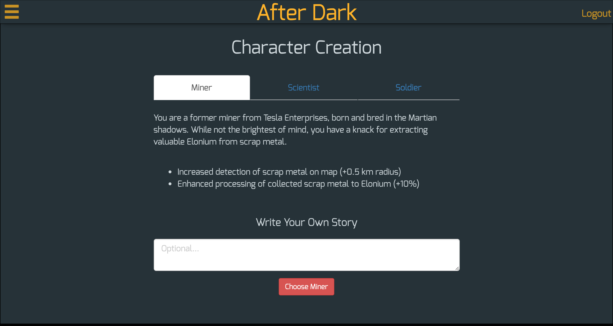
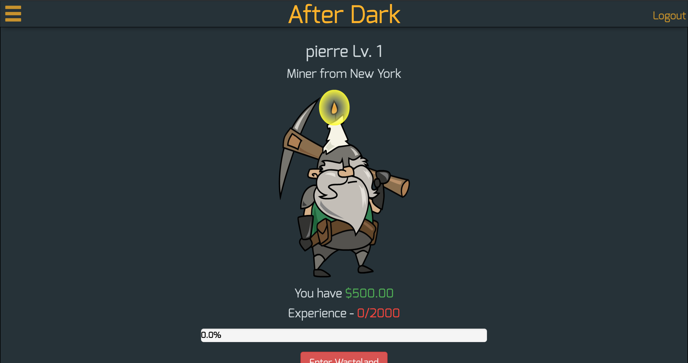
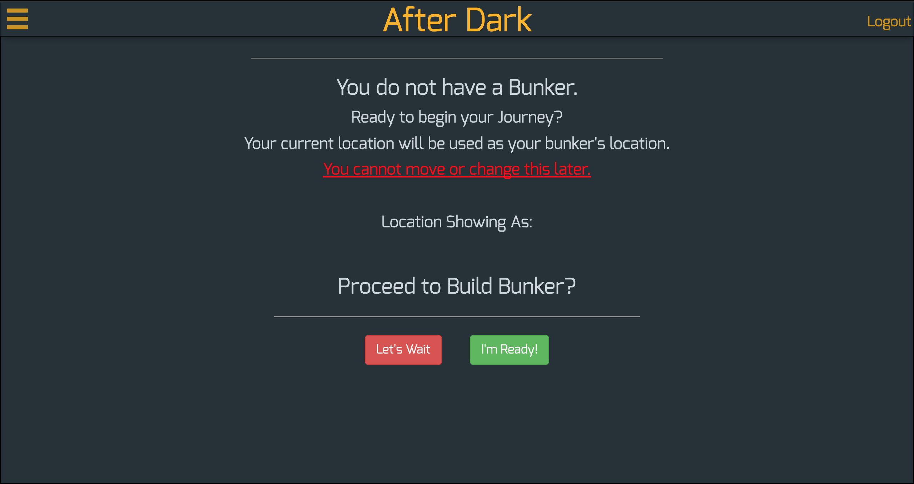

## After-Dark

A browser-based augmented reality game set 500 years in the future, where you play
to survive in an unforgiving world. You can collect resources, do battle
with the unruly inhabitants of Earth, trade with other players and build
your own empire as you progress in the game. After-Dark can be simultaneously
enjoyed on both mobile and desktop.

## Features

### Bunker View

#### Dynamic Tile-mapping

Floors, resource enhancing modules, defensive weapons, you name it - players with
enough resources can choose to add any amount of upgrades to their bunker, so long as there
is space.

#### Mobile Joystick

Through the PhaserJS plugin Touch Control, players can move around their bunker freely on mobile.

### Map View

#### Real-time geolocation

Feel like you are roaming the streets of Manhattan, but only much more alone,
with real-time location tracking. We take advantage of the HTML Geolocation API to do this,
allowing mobile users to experience the events of After-Dark in the real world.

#### Fog of War

PhaserJS, along with the GeoFire/Firebase API, were used to achieve the 'fog of war' such that players gradually discover more of their surroundings. Players can only interact and see events in areas they've explored before (to be implemented).

###

## Usage

#### I. Setting up your character and bunker
Players can select one of three different characters
* Miner
* Scientist
* Soldier

 

**Character Overview**

Displays:
* *Current experience and level*
* *Resources* (money, water, air, electricity, metal)
* *Character stats* (these affect event outcomes)

 

***Bunker Placement***

Clicking the 'I'm Ready!' button will cause a bunker to be placed on your
physical location, which is reflected by an icon on the Map View.

 

####

## Technologies Used

#### Front End
* AngularJS(v1.5)
* HTML5/CSS3
* PhaserJS

#### Back End
* ExpressJS
* Sequelize ORM
* Firebase API
* Geofire API
* PostGreSQL

## Contributors
* Pierre Baize
* Eliot Szwalkjowski
* Justin Yeh

